# Grayscale-Image-Colorization

## Introduction
In this project, we tackle the problem of image colorization, i.e. given an input gray-scale image, we output a color image. The problem of image colorization presents many challenges. Firstly, this is an ill-posed problem as we need to predict multiple values (color) per pixel given only one value per pixel. Secondly, blending the colors to form a perceptually descent output can be non-trivial compared to coloring a particular object instance. Also, certain objects/entities/scenes can have multiple colors, e.g. the color of the sky during day and night, the color of a car etc. Considering these issues, image colorization still remains an open research problem.

Some of the applications of image colorization, which include enhancement of old images taken from analog film cameras, colorization of sketch images, compressing images etc, make colorization an interesting problem to solve. In this work, first we implement a GAN based image-to-image translation model for the coloration task. We use a conditional generative adversarial network for colorizing gray-scale images as described in  [*"Image-to-Image Translation with Conditional Adversarial Networks"*](https://arxiv.org/abs/1611.07004). The paper experiments on the viability of using conditional GANs as general purpose image-to-image translation models. We plan on adopting this model specifically for the problem of gray-scale image colorization. We utilize L*a*b* color space for solving this problem. That is, given the L* channel, we predict the a and b channels via the generative network and combine with L channel to generate a colorful output, as shown below.

    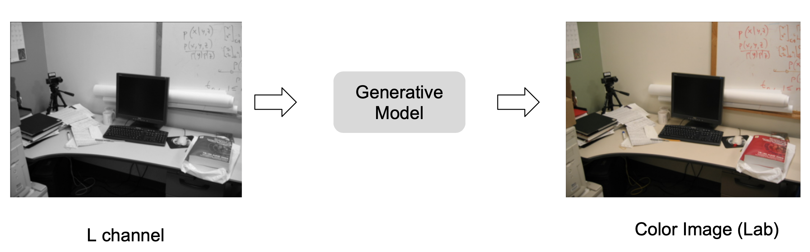

## Related Work
Many different deep-learning based techniques have been employed to solve the colorization problem. Models like [Deep Colorization](https://arxiv.org/abs/1605.00075), [Colorful Colorization](https://arxiv.org/abs/1603.08511), and [Deep Depth Colorization](https://arxiv.org/abs/1703.10881), use CNN's to colorize an image. Certain works utilize GAN's to colorize images, such as [Unsupervised Diverse Colorization](https://arxiv.org/abs/1702.06674), [Image-to-Image Translation](https://arxiv.org/abs/1611.07004), and [ChromaGAN](https://ieeexplore.ieee.org/document/9093389). GAN's generate color by making the Generator and Discriminator networks compete with one another. The Generator tries to out-smart the Discriminator, and the Discriminator distinguishes between the output and the colors generated. 

One of the recent works in coloration is [Instance Aware Image Colorization](https://arxiv.org/abs/2005.10825) which is an [Exemplar-based colorization technique](https://arxiv.org/abs/2008.10774). The model consists of an off the shelf object detector, an object instance colorizer, a full image colorizer, and a fusion model which blends the outputs of the two colorizer networks. This model outperforms other models such as [Let There be Color!](https://dl.acm.org/doi/10.1145/2897824.2925974) and [Automatic Colorizer](https://arxiv.org/abs/1603.06668).

Very recently, diffusion models have become popular for solving many generative modelling tasks and have achieved state-of-art results. [Palette: Image-to-Image Diffusion Models](https://arxiv.org/abs/2111.05826) is a recent work on which combines image-to-image translation with diffusion modelling to solve many translation tasks like coloration.

## Dataset
We will use the [Common Objects in Context (COCO-stuff)](https://arxiv.org/pdf/1405.0312.pdf) dataset which consists of over 200k labeled images and 80 object categories for our experiments. We sample 10,000 random images from COCO-stuff and use 8,000 images for training and 2,000 images for inference. During inference we calculate the Fréchet Inception Distance (FID) and the Learned Perceptual Image Patch Similarity (LPIPS) metrics on the inference data.

## Colorspaces

A color gamut defines the space of colors a color model is capable of representing. The CIE XYZ color space as shown by the shaded region in figure below represents 
the region which is visible to human eyes. Inside this region, many color models have been developed based on different needs like image acquistion techniques,
display devices, perceivability and more. One of the most  common color spaces is the sRGB color space which is adpoted as a standard color space for the World Wide Web. 

    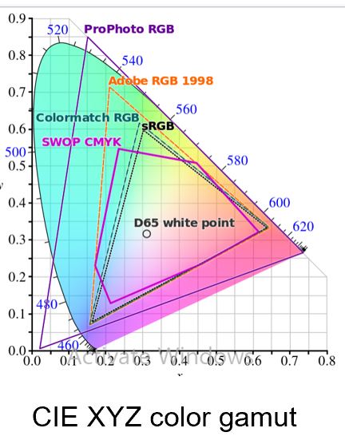

One of the important color spaces is the CIE L*a*b* color space which was designed to be be perceptually uniform. That is, a numeric change should correspond to similar perceived change in color. The range of variation of L (Lightness), a(green-red), b(blue-yellow) is described in the figure below.
The Lab color space is effective at modelling color variations perceptually similar to humans making it suitable for the image coloration task. Following other works, we adopt this Lab color space for solving the coloration problem.

    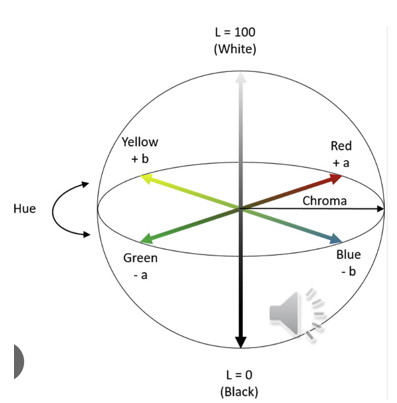

## Model Architecture
### GAN
A GAN consists of a generator and a discriminator network. The generator is trained to generate images from input random noise, while the discriminator tries to classify whether the image produced by the generator is real or fake. GAN's are trained using backpropogation in two steps - 
 - **Step 1** - In first step, the generator weights are frozen and images are generated by forward pass through the generator. The discriminator is updated to identify this fake image compared to a real image from the data distribution. As training progresses, the discriminator becomes better at identifying fake images from real images.
 - **Step 2** - In the second step, the discriminator weights are frozen and the generator network is updated to fool the discriminator by producing more realistic images.

 The above two steps are repeated as the generator and discriminator are involved in a min-max game. The objective function used to optimize the GAN is a mixture of losses of the generator and discriminator and is given as follows - 

    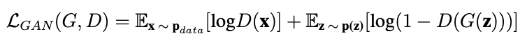

where G and D are the generator and discriminator networks, **x** is the input image, and **z** is the randomly samples noise vector. The below image shows a pictorial representation of a GAN.

    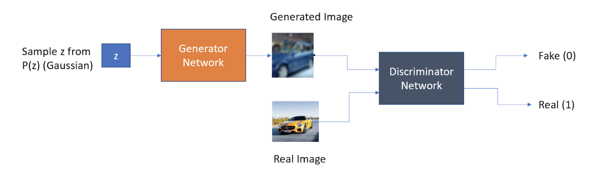

### Conditional GANs (cGAN)
The training in GAN's is completely unsupervised, that is, the actual labels are not fed as input to the networks. In a conditional GAN (cGAN), an additional input is fed into the generator alongside the noise vector and also in the discriminator network. In this type of GAN, the discriminator will classify whether the generated image is real or fake conditioned on the input. The conditional input can be anything like a label or an image itself. In translation tasks, the conditional input is typically an image which needs to be translated. The objective function to train a cGAN is very similar to that used to train a GAN, with the addition of the conditioning. The objective is given below -

    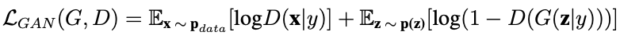

However, for the case of colorizing grayscale images, the task of the generator is to not only fool the discriminator, but also to be as close to ground truth as possible. To do this we can either introduce L1 or L2 loss into the training process. We use the L1 loss as opposed to the L2 loss, as L2 encourages blurring of the image. The L1 loss also acts as a regularizer for the generator, in the sense that it tries to keep outputs generated as close as possible to the ground truth. Thus, the final combined loss function we optimize is as shown below - 

    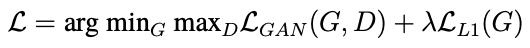

The following image shows a block diagram of a Conditional GAN.

    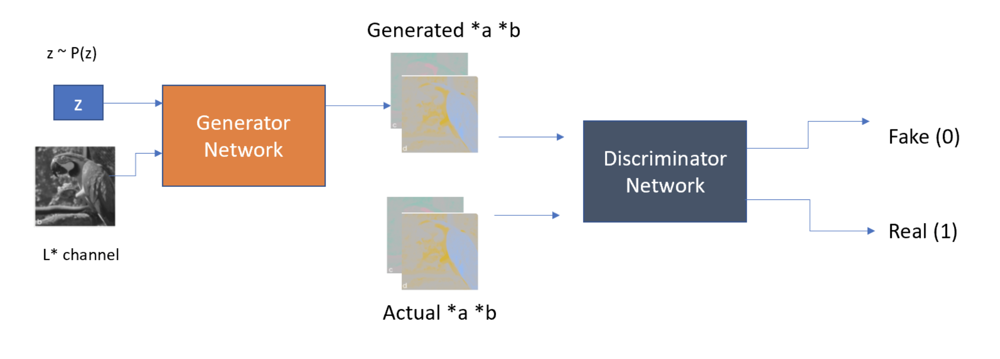

### UNet (Generator)
The generator network used in the cGAN for grayscale image colorization is a UNet. An important aspect of image colorization is that a network maps high resolution inputs to high resolution outputs. While the input and output may have differences, their underlying structure remains the same. A common strategy to maintain such structure is to use encoder-decoder based networks. An UNet is a form of encoder-decoder network with additional skip connections. These skip connections help concatenates all channels at layer *i* and layer *n - i*. These skip connections help in reducing the amount of information flowing through the network, and helps sharing of information amongst layers. The below image depicts a standard UNet. 

    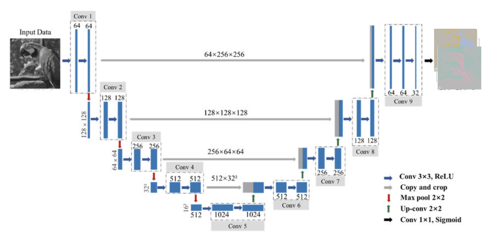

Recently, it has been shown that replacing the standard encoder in UNet with ResNet blocks can improve the performance on image-to-image translation tasks. As shown in figure below, each downsampling layer is a Resnet Block. We adapt this Unet encoder architecture for our model.

    

### PatchGAN (Discriminator)
A discriminator typically checks if a generated image is real or fake. However, checking if an entire image is real or fake is slightly expensive. Thus, the authors of the paper [Image-to-Image Translation](https://arxiv.org/abs/1611.07004) have used a PatchGAN architecture of the discriminator which classifies patches of an image as real or fake. This reduces the number of parameters in the discriminator as well as checks image quality at a local patch level helping remove artifacts. Also it helps the cGAN to monitor high frequency structure of the image.

    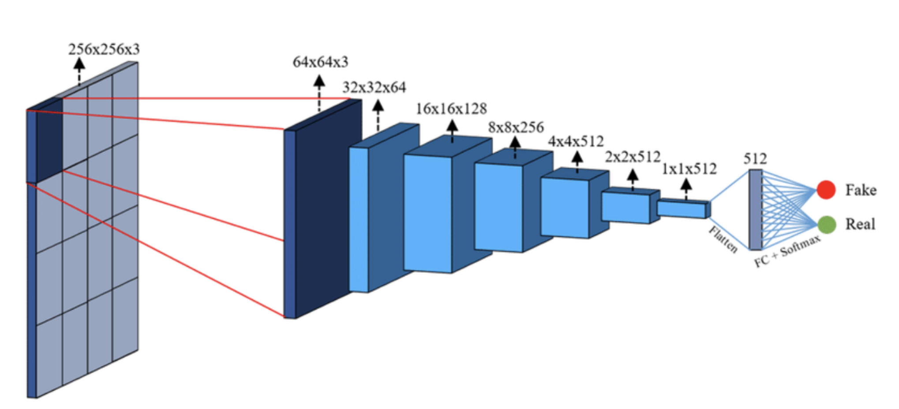

### Training and Inference
We trained the conditional UNet based cGAN on 8000 images for 100 epochs. The images from the COCO-stuff dataset are first converted into the Lab color space. The L channel from the Lab color space is akin to a grayscale version of the image. Thus, the L channel is fed as input into the cGAN, and the model outputs the ab channels of the image.

During inference we use a trained generator to produce the a and b channels of an image from the input L channel. We further combine all three channels to get the resultant colored image. The following image describes the inference procedure.

    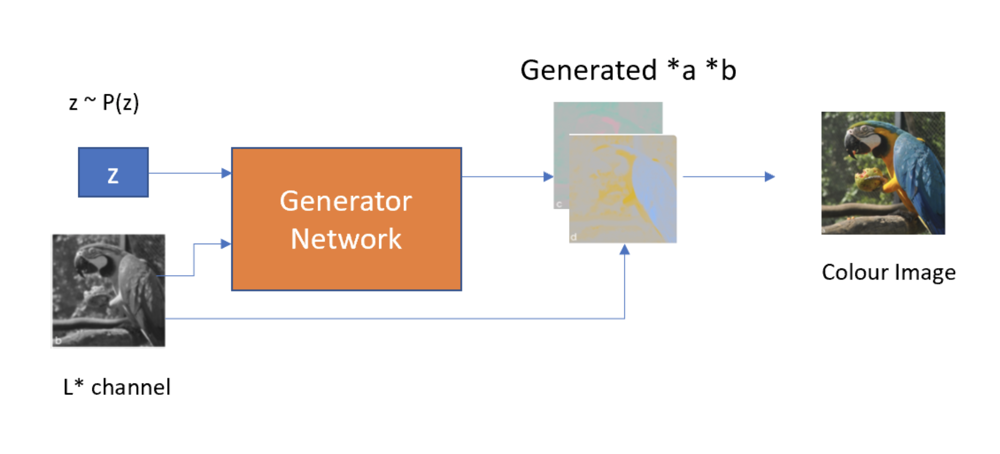

## Results
Some of the coloration results on test set are shown below. The picture on the left is the original colored image, the picture in the middle is the input grayscale image, and the image on the right is the output produced by our model.

    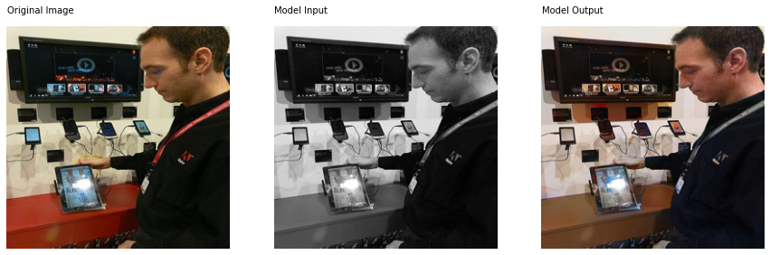
    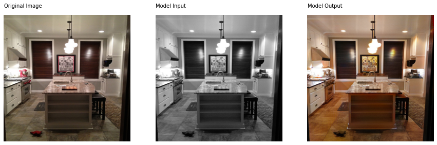
    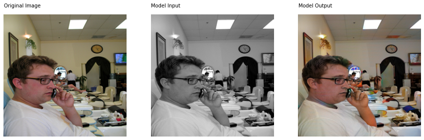
    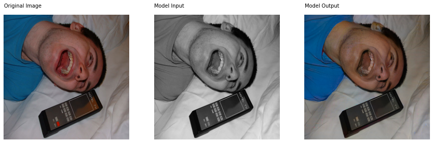
    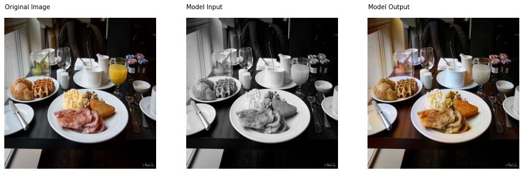
    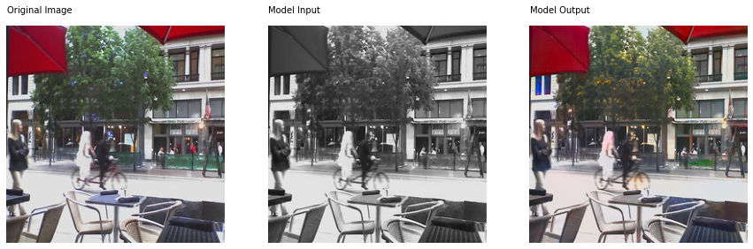

### Quantitative Analysis

We calculate FID and LPIPS on 2000 images from the COCO-stuff validation set. The average test set LPIPS was 0.139. The table below highlights the FID scores - 

<table>
  <tr>
    <th>Our Model</th>
    <th>Pix2Pix</th>
    <th>Palette (SOTA)</th>
  </tr>
  <tr>
    <td>21.2</td>
    <td>24.41</td>
    <td>15.78</td>
  </tr>
</table>

We see that there is a performance gap compared to state-of-the-art model, Pallete. This diffusion based model is able to perform much better but it also has certain limitations. Specifically, the inference step of diffusion models is slow. Therefore, GAN based models are still useful in cases where faster inference is required.

## Experiments

### Different forms of Grayscale Input
Here, we test how the output differs when we change the type of grayscale image input into the model. For this experiment, we convert the original colored image into - a) YCbCr image b) Linearly RGB Weighted Grayscale Image. The Y channel of the YCbCr image is grayscale. Thus, we input the Y channel into the model. The below results show the images generated when we use varying grayscale images as input. We see that the colored images produced are very similar, and this can also be seen in the corresponding LPIPS scores.

    
    

### Results on Real Images
We tested the model on images we clicked with an iPhone. While the model is not perfect, we can still see that it is able to predict some shades of the right color. The picture on the left is the original colored image, the picture in the middle is the input grayscale image, and the image on the right is the output produced by our model. 

    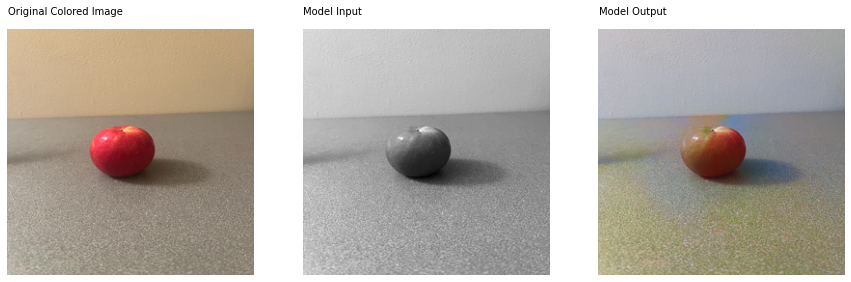
    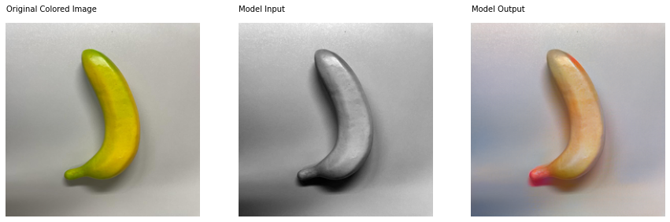
    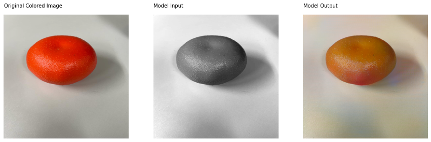

## Links

1. [Project Presentation] (https://docs.google.com/presentation/d/1ETVOi3vrmDBB708tWbigWofgOdq-_dUJDXnBRXTEFSY/edit?usp=sharing)
2. [Code-Github] (https://github.com/arunravi287/Grayscale-Image-Colorization)

## References

1. Image-to-Image Translation with Conditional Adversarial Networks, https://doi.org/10.48550/arxiv.1611.07004, Isola, Phillip and Zhu, Jun-Yan and Zhou, Tinghui and Efros, Alexei A. CVPR, 2016 

2. [Palette: Image-to-Image Diffusion Models, Chitwan Saharia et.al 2021] (https://arxiv.org/abs/2111.05826)

3. https://rodrigoberriel.com/2014/11/opencv-color-spaces-splitting-channels/

