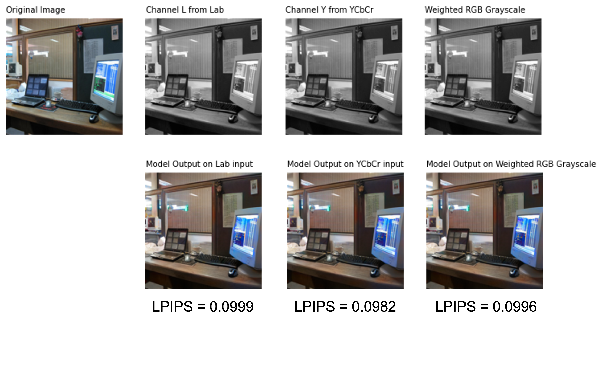
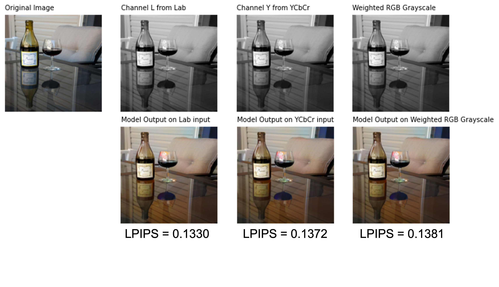

# Grayscale-Image-Colorization

## Introduction
In this project, we will tackle the problem of image colorization, i.e. given an input gray-scale image, we output a color image. The problem of image colorization present many challenges. Firstly, this is an ill-posed problem as we need to predict multiple values (color) per pixel given only one value per pixel. Secondly, blending the colors to form a perceptually descent output can be non-trivial compared to coloring a particular object instance. Also, certain objects/entities/scenes can have multiple colors, e.g. the color of the sky during day and night, the color of a car etc. Considering these issues, image colorization still remains an open research problem.

Some of the applications of image colorization, which include enhancement of old images taken from analog film cameras, colorization of sketch images, compressing images etc, make colorization an interesting problem to solve.

## State of the Art
Many different deep-learning based techniques have been employed to solve the colorization problem. Models like [Deep Colorization](https://arxiv.org/abs/1605.00075), [Colorful Colorization](https://arxiv.org/abs/1603.08511), and [Deep Depth Colorization](https://arxiv.org/abs/1703.10881), use CNN's to colorize an image. Certain works utilize GAN's to colorize images, such as [Unsupervised Diverse Colorization](https://arxiv.org/abs/1702.06674), [Image-to-Image Translation](https://arxiv.org/abs/1611.07004), and [ChromaGAN](https://ieeexplore.ieee.org/document/9093389). GAN's generate color by making the Generator and Discriminator networks compete with one another. The Generator tries to out-smart the Discriminator, and the Discriminator distinguishes between the output and the colors generated. 

One of the recent works in coloration is [Instance Aware Image Colorization](https://arxiv.org/abs/2005.10825) which is an [Exemplar-based colorization technique](https://arxiv.org/abs/2008.10774). The model consists of an off the shelf object detector, an object instance colorizer, a full image colorizer, and a fusion model which blends the outputs of the two colorizer networks. This model outperforms other models such as [Let There be Color!](https://dl.acm.org/doi/10.1145/2897824.2925974) and [Automatic Colorizer](https://arxiv.org/abs/1603.06668).

Very recently, diffusion models have become popular for solving many generative modelling tasks and have achieved state-of-art results. [Palette: Image-to-Image Diffusion Models](https://arxiv.org/abs/2111.05826) is a recent work on which combines image-to-image translation with diffusion modelling to solve many translation tasks like coloration. Unlike other methods which use the LAB color space, they directly generate RGB outputs.

In this work, first we implement a GAN based image-to-image translation model for the coloration task.

## Methodology
In this project, we use a conditional generative adversarial network for colorizing gray-scale images as described in  [*"Image-to-Image Translation with Conditional Adversarial Networks"*](https://arxiv.org/abs/1611.07004). The paper experiments on the viability of using conditional GANs as general purpose image-to-image translation models. We plan on adopting this model specifically for the problem of gray-scale image colorization.

### Dataset
We will use the [Common Objects in Context (COCO-stuff)](https://arxiv.org/pdf/1405.0312.pdf) dataset which consists of over 200k labeled images and 80 object categories for our experiments. We also plan to use a subset of the ImageNet data to train and evaluate our model. Specifically, we will use the first 5000 validation images in ImageNet to evaluate our model using the FID score. This is the current standard adopted by recent works for comparison.

We plan to use subsets of ImageNet and COCO-stuff and check cross-domain performance of the model. i.e given a model trained on COCO-stuff, how well it performs on ImageNet. **Our current (proof-of-concept) model (trained till now)  uses 2100 images for training and 900 images for validation.** To setup the training data, we convert the RGB images to Lab color space, which we use in our technique. The use of Lab color space for coloration problems is well established in prior-work.

## Model Architecture
### GAN
A GAN consists of a generator and a discriminator network. The generator is trained to generate images from input random noise, while the discriminator tries to classify whether the image produced by the generator is real or fake. GAN's are trained using backpropogation in two steps - 
 - **Step 1** - In first step, the generator weights are frozen and images are generated by forward pass through the generator. The discriminator is updated to identify this fake image compared to a real image from the data distribution. As training progresses, the discriminator becomes better at identifying fake images from real images.
 - **Step 2** - In the second step, the discriminator weights are frozen and the generator network is updated to fool the discriminator by producing more realistic images.

 The above two steps are repeated as the generator and discriminator are involved in a min-max game. The objective function used to optimize the GAN is a mixture of losses of the generator and discriminator and is given as follows - 

$$
    \mathcal{L}_{GAN}(G, D) = \mathbb{E}_{\textbf{x $\sim$ p}_{data}}[\text{log} D(\textbf{x})] + \mathbb{E}_{\textbf{z $\sim$ p(\textbf{z})}}[\text{log} (1 - D(G(\textbf{z})))]
$$

where G and D are the generator and discriminator networks, **x** is the input image, and **z** is the randomly samples noise vector.

### Conditional GANs (cGAN)
The training in GAN's is completely unsupervised, that is, the actual labels are not fed as input to the networks. In a conditional GAN (cGAN), an additional input is fed into the generator alongside the noise vector and also in the discriminator network. In this type of GAN, the discriminator will classify whether the generated image is real or fake conditioned on the input. The conditional input can be anything like a label or an image itself. In translation tasks, the conditional input is typically an image which needs to be translated. The objective function to train a cGAN is very similar to that used to train a GAN, with the addition of the conditioning. The objective is given below -

$$
    \mathcal{L}_{GAN}(G, D) = \mathbb{E}_{\textbf{x $\sim$ p}_{data}}[\text{log} D(\textbf{x}|y)] + \mathbb{E}_{\textbf{z $\sim$ p(\textbf{z})}}[\text{log} (1 - D(G(\textbf{z}|y)))]
$$

However, for the case of colorizing grayscale images, the task of the generator is to not only fool the discriminator, but also to be as close to ground truth as possible. To do this we can either introduce L1 or L2 loss into the training process. We use the L1 loss as opposed to the L2 loss, as L2 encourages blurring of the image. The L1 loss also acts as a regularizer for the generator, in the sense that it tries to keep outputs generated as close as possible to the ground truth. Thus, the final combined loss function we optimize is as shown below - 

$$
    \mathcal{L} = \text{arg min$_G$ max$_D$} \mathcal{L}_{GAN}(G, D) + \lambda \mathcal{L}_{L1}(G)
$$

### UNet (Generator)
The generator network used in the cGAN for grayscale image colorization is a  UNet. An important aspect of image colorization is that a network maps high resolution inputs to high resolution outputs. While the input and output may have differences, their underlying structure remains the same. A common strategy to maintain such structure is to use encoder-decoder based networks. An UNet is a form of encoder-decoder network with additional skip connections. These skip connections help concatenates all channels at layer $i$ and layer $n - i$. These skip connections help in reducing the amount of information flowing through the network, and helps sharing of information amongst layers.

### PatchGAN (Discriminator)
A discriminator typically checks if a generated image is real or fake. However, checking if an entire image is real or fake is slightly expensive. Thus, the authors of the paper  [Image-to-Image Translation](https://arxiv.org/abs/1611.07004) have used a PatchGAN architecture of the discriminator which classifies patches of an image as real or fake. This reduces the number of parameters in the discriminator as well as checks image quality at a local patch level helping remove artifacts. Also it helps the cGAN to monitor high frequency structure of the image.

## Training
We trained the conditional UNet based cGAN on 8000 images for 100 epochs. Attached below are the results obtained - the picture on the left is the grayscale image, the picture on the right is the original colored image, the picture in the center is version produced by our model.

    
    
    
    
    
    
    

## Failure Cases

The model seems t face problems in distinguish greens and blues. The following two images show this phenomenon.

    
    

The model also seems to struggle when we the image has multiple smaller objects or multiple colors. These following images show that the model is unable to find differences in small chnages in color patterns.

    
    

Also when the input image is an original grayscale image, the model still tries to colorize it as shown in the following examples.

    
    

## Experiments

### Inference on ImageNet

### Lab vs Luv

The first picture (starting from the left) is the grayscale image, the second image is the Lab version generated by the cGAN, the thirs picture is the original RGB image, and the fourth picture is the Luv image generated by the cGAN model. We see the Luv image has slightly brighter reds as compared to the Lab image.

    
    
    

